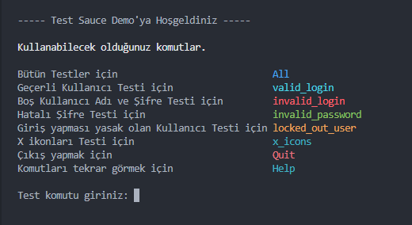

# Python Selenium Kampı Hafta-2 4. Gün Ödevi

### Kodu kendi bilgisayarınızda çalıştırmak isterseniz
- requirements.txt dosyasındaki kütüphanelerin sisteminizde bulunması gerekir

Sonrasında kodu komut satırına
```sh
python main.py
```
yazarak çalıştırabilirsiniz

## İlk çalıştırma



Kodu ilk çalıştırdığınızda karşınıza bu ekran çıkacaktır. Buradan sonra yönergeleri takip eder kodu deneyebilirsiniz. Komutları yazarken büyük veya küçük veya karışık şekilde yazabilirsiniz.

